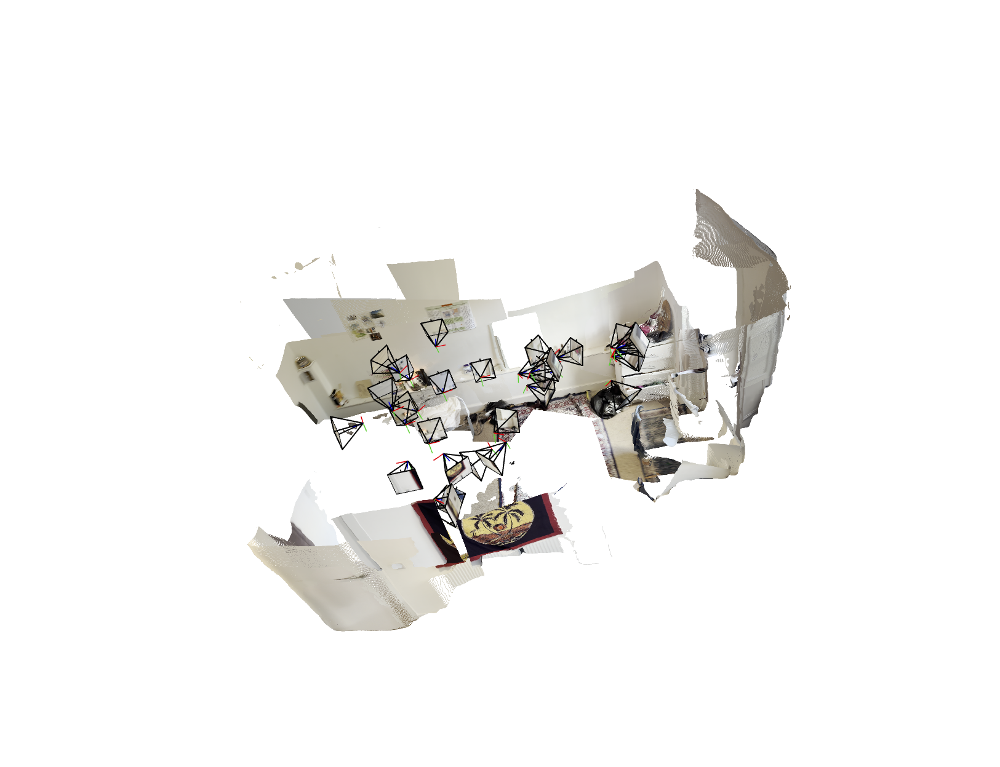

# Humanoid-3D-reconstruction-project

# Field Notes: What a Robot Learns From Your Room

A robot entering a room for the first time doesn't just need to know where the walls are. It needs to understand the space — what's in it, what matters, who lives there.

This project takes a short phone video of a room, reconstructs it in 3D, and tries to answer that question. The output isn't just a point cloud. It's a set of field notes: what the room contains, where things are, and what that tells you about the person inside it.

The test case is my own room — Persian rugs, hand-sewn tapestries, a rocket-shaped lava lamp. The field notes it generates could only come from this room. That specificity is the point.

## What it does

You film a room on your phone. The system extracts frames from the video and passes them to VGGT, a neural network from Oxford and Meta that figures out the 3D structure of the scene in under a second — depth, camera positions, point cloud, all in one forward pass. No COLMAP, no iterative fitting.

Once the geometry exists, a rule-based semantic engine identifies what's actually in the room and what it means for a robot operating in that space. Not "this person is creative" — but "this object has high sentimental value, do not touch" or "this is a focused work zone, avoid interrupting."

The output is structured like field notes. Dry, specific, observational. The kind of record a robot would keep after entering an unknown space for the first time.

## How to run

**1. Clone VGGT and install dependencies**

```bash
git clone https://github.com/facebookresearch/vggt.git
cd vggt
pip install -r requirements.txt
pip install -r requirements_demo.txt
```

**2. Extract frames from your video**

```bash
ffmpeg -i your_video.mov -vf "fps=2" frames/frame_%04d.png
```

**3. Run 3D reconstruction**

```bash
python demo_viser.py --image_folder frames/
```

**4. Run automatic object detection (optional)**

If you have Grounding DINO weights:

```bash
python run.py --video your_video.mov --weights path/to/groundingdino_swint_ogc.pth
```

Without weights, pass objects manually:

```bash
python run.py --objects rug lamp tapestry desk books
```

**5. Run the semantic pipeline**

```bash
python run.py --objects rug lamp tapestry desk books
```

Results saved to `output/field_notes.txt` and `output/person_model.json`.

## Example reconstruction



## Requirements

- Python 3.10+
- CUDA-capable GPU (tested on RTX 4070 8GB and A100 80GB)
- ffmpeg
